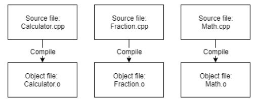

## 编译阶段

为了编译 C++ 源代码文件，我们使用 C++ 编译器。C++ 编译器按顺序检查程序中的每个源代码 (.cpp) 文件并执行两项重要任务：

首先，编译器会检查您的 C++ 代码，以确保它符合 C++ 语言的规则。如果不符合，编译器会给出错误（以及相应的行号），帮助您确定需要修复的内容。编译过程也会中止，直到错误得到修复。

其次，编译器将 C++ 代码翻译成机器语言指令。这些指令存储在中间文件中，称为目标文件。目标文件还包含后续步骤中必需或有用的元数据。

目标文件通常命名为name.o或name.obj，其中name与生成它的 .cpp 文件的名称相同。

例如，如果你的程序有 3 个 .cpp 文件，编译器将生成 3 个目标文件：

